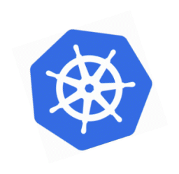

    

<!-- <a href="https://github.com/SleepyLGod/">
    <h3 align="center">
         
        Dong's Profile
    </h3>
</a> -->
 
<h3 align="center">
    
</h3>

<!--      -->
<!-- # Hi there 👋  -->
- 🎓 Undergraduate study. @HUST China
- 🔭 Research includes Web3, Databases, Distributed, HPC, KV Storage, etc.
- 🏆 Used to participate in some contests. **Won the 1st prize🥇** of [the 17th **"Challenge Cup"** National College Student Curricular Academic Science and Technology Works Competition](http://mse.hust.edu.cn/info/1180/11133.htm). 
- 🚀 Participated in **six** innovation projects for college students, one **national** project and one **provincial** project included.
- 👑 Founder of [**JumboArbitrage**](https://github.com/JumboArbitrage) and [**HUST-FOCUS**](https://github.com/HUST-FOCUS).
- :octocat: Currently working on closed-source software. Previously completed labs including cmu-15-445, mit6.824, mit6.s081, tinykv, etc.
- ✨ **Fun fact**: [**A repo receiving some stars**](https://github.com/SleepyLGod/qwidget-demo) including several Qt components that mimic css rendering I forked and revised when I'm university freshman.
- 📫 Reach me at 2441164168+lhd@gmail.com
- 🏠 Blog homepage at [Rookie's Notes](https://rookiedong.gitbook.io/notes).
- 
  

## 🤗 Languages & Tools &nbsp;&nbsp;

<!-- 
           <a href="https://www.mysql.com/" target="_blank">           

 -->

           <a href="https://www.mysql.com/" target="_blank">         

  
## 📊 Github Stats &nbsp;&nbsp;

  

    
    
    

        <i><b>:octocat:Top languages is only a metric of the languages my public code consists of and doesn't reflect experience or skill level.</b><i/>
    

      
  

  

    
  

   
  

    
  

 

  

    

